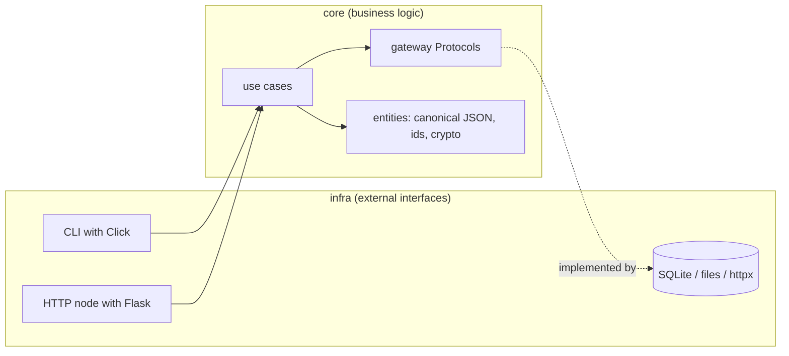
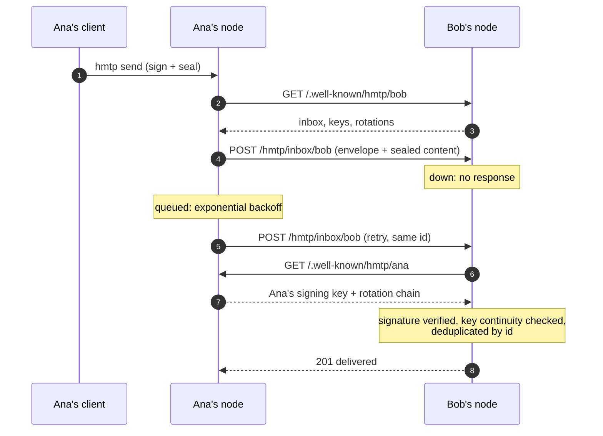

# HMTP

**HTTP Mail Transfer Protocol**: a minimal self-hosted mail node over HTTP. No SMTP.

Protocol specification: [SPEC.md](SPEC.md)

HMTP is a thought experiment turned into working code: what would email look like if it were designed today, on top of the tools we already have? Nothing in this node is invented; every piece is a standard already deployed at scale:

| Problem | Existing technology | Who uses it today |
|---|---|---|
| Transport and status codes | HTTP | The whole web |
| Transport encryption | TLS + Let's Encrypt | The whole web |
| User discovery | A `.well-known` document | WebFinger, Mastodon |
| Message delivery | POST to an inbox | ActivityPub |
| Sender verification at the source | The Webmention / DKIM pattern | IndieWeb, all email |
| Signatures | Ed25519 | SSH, Signal |
| Content encryption | X25519 sealed boxes | age, Signal |
| Deduplication | Content-addressed ids | Git, IPFS |
| First-contact consent | Message requests | Signal, Instagram |
| Mailbox storage | SQLite | Every phone on Earth |

It never talks to SMTP: it only federates with other HMTP nodes.

Your identity is `user@domain`. The domain serves `GET /.well-known/hmtp/<user>` with your inbox URL and your public keys (this doubles as an MX record: the inbox can live on any host). A message is a visible envelope `{from, to, date}` plus a sealed payload carrying the subject and the body, encrypted to the recipient's X25519 key (ChaCha20-Poly1305): the receiving server stores ciphertext it cannot read, and the subject travels as protected as the body (PGP left it in the clear for decades; we don't). The `id` is the SHA-256 of the canonical plaintext, computed before sealing, so every copy of a message shares the same id, thread references match across nodes and retries are idempotent. The Ed25519 `signature` covers the envelope, the id and the ciphertext: the receiver fetches the sender's key from the sender's domain and verifies before accepting, and the recipient re-checks the id against the plaintext after unsealing. Delivery is a `POST` to the recipient's inbox. `201` delivered, `200` duplicate, `401` bad signature, `503` sender keys unreachable (retry later), `413` too large.

Version 1 also covers encrypted attachments by reference (blobs mirrored by the recipient's server at delivery, deferred for strangers), optional postage stamps for strangers (`402`), a signing-key rotation chain with per-sender continuity pins, per-device sealed copies, and a token-authenticated read endpoint for your devices.

The exact wire format (canonical JSON, ids, signatures, sealing, attachments, postage, rotation, status codes, verification duties) is specified in [SPEC.md](SPEC.md), including a test vector for writing interoperable implementations in other languages. Read the article [Modern email can be built from borrowed parts](https://en.andros.dev/blog/d7ed8b07/modern-email-can-be-built-from-borrowed-parts/) for the design rationale.

## Architecture

The codebase follows clean architecture: business logic in `core`, the outside world in `infra`, dependencies always pointing inwards. Use cases receive their gateways (storage, network, blob store, config) as injected interfaces and return plain dictionaries (`{type, errors, data}`); exceptions never cross a layer boundary.

```
hmtp/
  core/
    entities/     # constants, canonical JSON, ids, crypto: pure logic
    gateways/     # Protocols the use cases depend on
    use_cases/    # one file per operation: send, receive, rotate, accept...
  infra/
    database/     # SQLite repository
    filesystem/   # config.json and blob storage
    gateways/     # httpx network client (SSRF guard lives here)
    api/flask/    # the HTTP node: discovery, inbox, mailbox, blobs
    cli/click/    # the command line
```

Swapping Flask, SQLite or httpx touches only `infra`; the protocol logic and its tests never change.



## How a delivery travels

The whole protocol fits in one exchange: two GETs to `.well-known` (discovery and verification), one POST (the delivery), and a queue on the sender's side when the destination is down.



## Quickstart

### 0. Prerequisites

Clone the repo and pick one of the three ways to run the node. Nothing else is needed for a local try-out; to federate with other nodes on the internet you will also need a domain with HTTPS in front, see [Production](#production).

```bash
git clone https://github.com/tanrax/hmtp.git
cd hmtp
```

**Option A: uv (recommended).** There is nothing to install: `uv run hmtp ...` resolves the project and its dependencies on first use. The examples below use this form.

**Option B: plain Python (3.11+).** Create a virtualenv, install the project, and use `hmtp ...` (or `.venv/bin/hmtp ...` without activating) wherever the examples say `uv run hmtp ...`:

```bash
python3 -m venv .venv
source .venv/bin/activate
pip install -e .
```

**Option C: Docker.** No Python on the host at all; see [Docker](#docker) below.

### 1. Create your identity and start your node

```bash
export HMTP_INSECURE=1   # local test only: plain HTTP, SSRF guard off
uv run hmtp init me@localhost:8025 http://localhost:8025
uv run hmtp serve
```

Leave `serve` running. Your node now publishes your address and signing key at `http://localhost:8025/.well-known/hmtp/me` and accepts deliveries on `/hmtp/inbox/me`.

### 2. Send a message

In another terminal (also with `HMTP_INSECURE=1` exported):

```bash
uv run hmtp send me@localhost:8025 "Hello, world. Signed and delivered."
# delivered sha256:a39442a5ad64f1351892200b41da1b21f332de9fb234d54727c2e0ddefef5f6e
```

Yes, you just mailed yourself, and that exercised the whole protocol: the sender discovered the inbox through the `.well-known` document, sealed the subject and the body to your published encryption key, signed the message with your Ed25519 key, delivered it with a POST, and the receiving side fetched the key back from the sender's address and verified the signature before accepting. On disk, subject and body are ciphertext; only `list` can read them.

### 3. Read your mail

```bash
uv run hmtp list
# == inbox ==
# [2026-07-27T05:49:46+00:00] me@localhost:8025  (sha256:a39442a5ad64)
#   Hello, world. Signed and delivered.
# == requests ==
```

Mail from senders you never wrote to lands in `requests` instead of `inbox`; promote a sender with `uv run hmtp accept <address>`. Reply to any message with `uv run hmtp reply <message-id> <text>` (the id is the `sha256:` shown by `list`): the reply carries the thread reference and a `Re:` subject. Subjects go on new mail with `-s`: `uv run hmtp send <address> -s "Subject" <text>`. If a delivery fails because the destination node is down, it is queued; `uv run hmtp flush` retries with exponential backoff.

For a real conversation between two different mailboxes, see the demo below.

## Demo: two nodes exchanging mail on one machine

Start two nodes, Ana and Bob, and make them exchange signed mail, including the contact-request flow.

Create both identities:

```bash
export HMTP_INSECURE=1
HMTP_HOME=/tmp/hmtp-a uv run hmtp init ana@localhost:8025 http://localhost:8025
HMTP_HOME=/tmp/hmtp-b uv run hmtp init bob@localhost:8026 http://localhost:8026
```

Run each node in its own terminal:

```bash
HMTP_HOME=/tmp/hmtp-a uv run hmtp serve 8025
HMTP_HOME=/tmp/hmtp-b uv run hmtp serve 8026
```

And in a third terminal (also with `HMTP_INSECURE=1`):

```bash
# Ana writes to Bob. Bob doesn't know her, so it lands in requests
HMTP_HOME=/tmp/hmtp-a uv run hmtp send bob@localhost:8026 "Hi Bob, testing hmtp"
HMTP_HOME=/tmp/hmtp-b uv run hmtp list

# Bob accepts Ana and replies. Ana already welcomed his replies
# (writing to someone accepts their answers), so it goes straight to her inbox
HMTP_HOME=/tmp/hmtp-b uv run hmtp accept ana@localhost:8025
HMTP_HOME=/tmp/hmtp-b uv run hmtp send ana@localhost:8025 "Hi Ana, received and signed"
HMTP_HOME=/tmp/hmtp-a uv run hmtp list
```

To see store and forward in action: kill Bob's node, send from Ana (you will see `queued (recipient node unreachable)`), start Bob's node again and run `flush` on Ana's side. The message gets delivered. In production that `flush` lives in a cron entry, with exponential backoff between attempts.

## Docker

If you prefer containers, the repo ships a `Dockerfile` and a `compose.yaml`. Create your identity once, then bring the node up:

```bash
docker compose run --rm hmtp init you@yourdomain.com https://yourdomain.com
docker compose up -d
```

This starts two containers: the node itself, published on `127.0.0.1:8025` (put your Nginx in front of it, see below), and a `flush` sidecar that retries queued deliveries every 5 minutes, so you don't need cron. Keys and mail live in `./data` on the host; back up that folder.

The CLI works through the same image:

```bash
docker compose run --rm hmtp send bob@example.org "hello from a container"
docker compose run --rm hmtp list
docker compose run --rm hmtp accept ana@example.com
```

## Production

Goal: a real node answering at `you@yourdomain.com`. In production there is no `HMTP_INSECURE`: TLS comes from Nginx + Let's Encrypt, and the node itself listens on localhost only, behind the proxy.

### 1. Point your domain at the server

Create an `A` (and `AAAA` if you have IPv6) DNS record for `yourdomain.com` pointing to your server's IP. Your address lives on this domain: other nodes will fetch `https://yourdomain.com/.well-known/hmtp/you` to verify your signatures.

### 2. Install Nginx and get a certificate

On a Debian/Ubuntu server:

```bash
sudo apt install nginx certbot python3-certbot-nginx
sudo certbot --nginx -d yourdomain.com
```

Certbot creates the HTTPS server block and keeps the certificate renewed. (Its own challenge uses `/.well-known/acme-challenge/`, which does not clash with `/.well-known/hmtp/`.)

### 3. Proxy the two HMTP routes

Inside the `server { listen 443 ssl; ... }` block that certbot configured, add:

```nginx
location /.well-known/hmtp/ { proxy_pass http://127.0.0.1:8025; }
location /hmtp/             { proxy_pass http://127.0.0.1:8025; }
```

Then check and reload:

```bash
sudo nginx -t && sudo systemctl reload nginx
```

### 4. Create your identity

Clone the repo on the server (e.g. into `/opt/hmtp`) and initialize with your real address and public URL.

With uv:

```bash
uv run hmtp init you@yourdomain.com https://yourdomain.com
```

With plain Python (create the venv as in the quickstart first):

```bash
.venv/bin/hmtp init you@yourdomain.com https://yourdomain.com
```

With Docker:

```bash
docker compose run --rm hmtp init you@yourdomain.com https://yourdomain.com
```

Keys and mail land in `~/.hmtp` (or `./data` with Docker). Back that up.

### 5. Run the node as a service

**With Docker (simplest).** Everything is already wired in `compose.yaml` (see the [Docker](#docker) section), so this step and the next are one command:

```bash
docker compose up -d
```

**With uv.** Create a systemd unit, `/etc/systemd/system/hmtp.service`:

```ini
[Unit]
Description=hmtp node
After=network.target

[Service]
User=you
WorkingDirectory=/opt/hmtp
ExecStart=/usr/local/bin/uv run hmtp serve
Restart=on-failure

[Install]
WantedBy=multi-user.target
```

**With plain Python.** The same unit, with this `ExecStart` instead:

```ini
ExecStart=/opt/hmtp/.venv/bin/hmtp serve
```

Then enable it:

```bash
sudo systemctl enable --now hmtp
```

The node serves through waitress, a production-grade WSGI server, so there is nothing to swap for real traffic.

### 6. Schedule the retry queue

Docker users already have the `flush` sidecar. Otherwise, one cron line (`crontab -e`).

With uv:

```bash
*/5 * * * * cd /opt/hmtp && /usr/local/bin/uv run hmtp flush
```

With plain Python:

```bash
*/5 * * * * cd /opt/hmtp && .venv/bin/hmtp flush
```

### 7. Verify

From anywhere, your identity document must be public:

```bash
curl https://yourdomain.com/.well-known/hmtp/you
# {"address": "you@yourdomain.com", "inbox": "https://yourdomain.com/hmtp/inbox/you", "signing_key": "...", "encryption_key": "..."}
```

And from the server, mail yourself through the full public loop (discovery, signature, delivery, verification).

With uv:

```bash
uv run hmtp send you@yourdomain.com "production ping"
uv run hmtp list
```

With plain Python:

```bash
.venv/bin/hmtp send you@yourdomain.com "production ping"
.venv/bin/hmtp list
```

With Docker:

```bash
docker compose run --rm hmtp send you@yourdomain.com "production ping"
docker compose run --rm hmtp list
```

### 8. Rotate your keys when you need to

```bash
uv run hmtp rotate
```

One command, no coordination with anyone. Because receivers fetch your current key from your domain on every delivery (nothing is pinned), the new signing key is trusted by the whole network the moment the command returns, and the old one becomes useless to a thief just as instantly. The rotation also keeps your old encryption keys in `config.json` so `list` can still decrypt mail that was sealed to them, and re-signs any queued outgoing mail so it will verify against the new published key. Rotate on a schedule, after restoring a backup onto a new machine, or whenever you suspect a key leaked.

You are now a mail server. Total moving parts: Nginx, one script, SQLite.

## Commands

```
hmtp init <address> <public-base-url>       create identity and database
hmtp serve [port]                           run the node (default 8025)
hmtp send <address> [-s <subject>] [-a <file>]... [--stamp <token>] <text>
hmtp reply <message-id> <text>              reply to a message (threaded)
hmtp attachments <message-id> [dir]         save and decrypt attachments
hmtp flush                                  retry queued deliveries
hmtp list                                   show inbox and contact requests
hmtp accept <address>                       accept a contact request
hmtp rotate                                 replace signing and encryption keys
hmtp postage on|off                         require stamps from strangers
hmtp stamp                                  issue a single-use postage stamp
hmtp token                                  print the mailbox read token
hmtp device keygen                          generate a key pair for a device
hmtp device add <name> <public-key>         publish a device encryption key
```

State lives in `$HMTP_HOME` (default `~/.hmtp`): `config.json` holds your keys, `hmtp.db` holds your mail. Back up both.

## What is deliberately left out

The remaining edges, listed in SPEC.md section 16: full JMAP synchronization (the read endpoint is deliberately minimal), payment rails for stamps (issuance is out of band), chunked encryption for large attachments, automated device enrollment, and timed re-anchor announcements. Everything else is in: end-to-end encryption of subject, body and attachments, threading, first-contact consent, postage for strangers, deduplication, exponential backoff, a signing-key rotation chain with continuity pins, multi-device copies, a production WSGI server. Each use case still fits on one screen, and the whole core reads in one sitting. A protocol you cannot extend on a Sunday afternoon would not deserve the experiment.

## License

[GPLv3](LICENSE)
