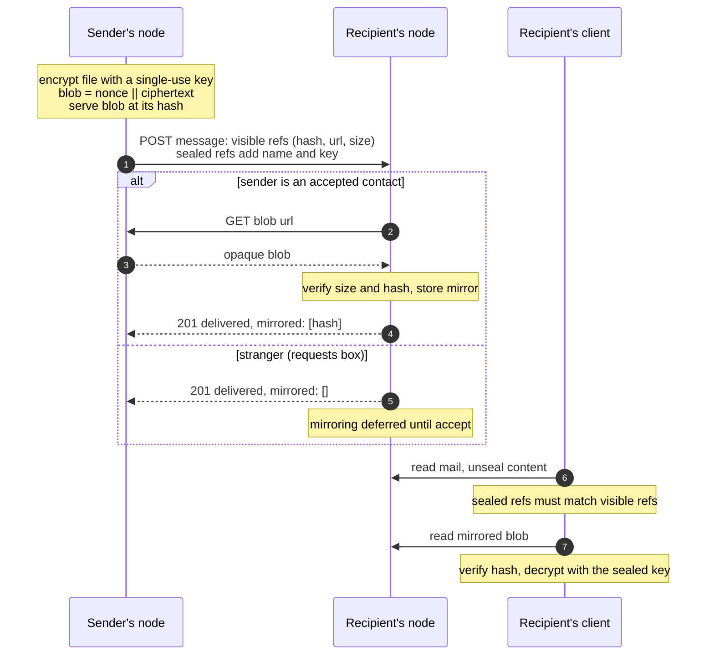
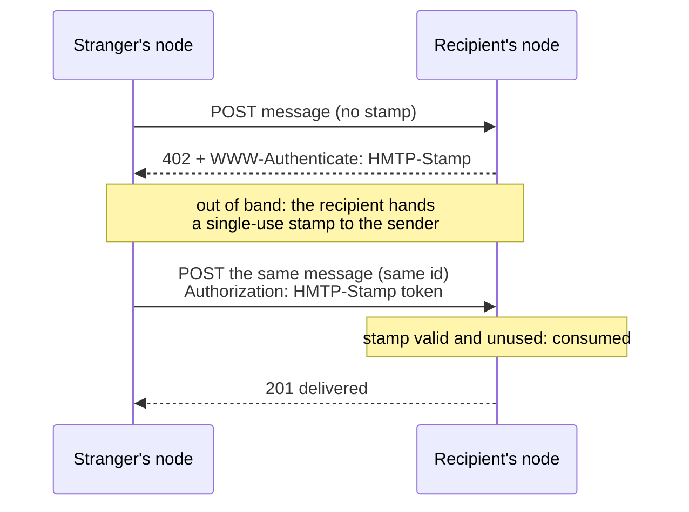
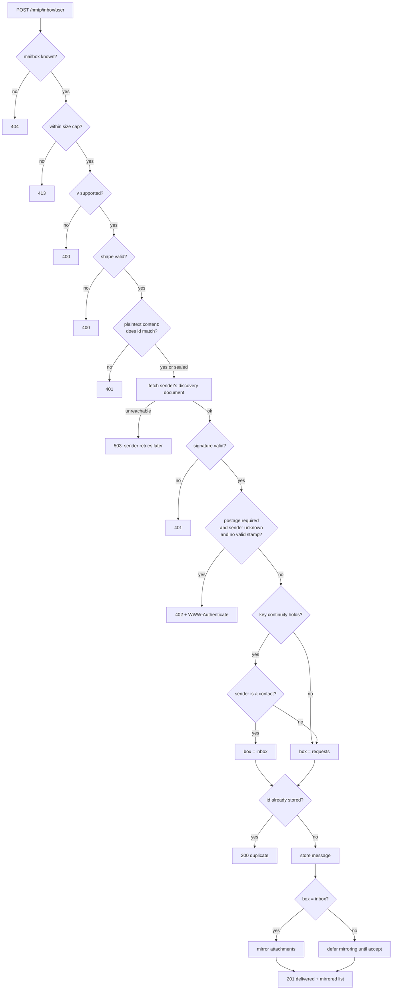
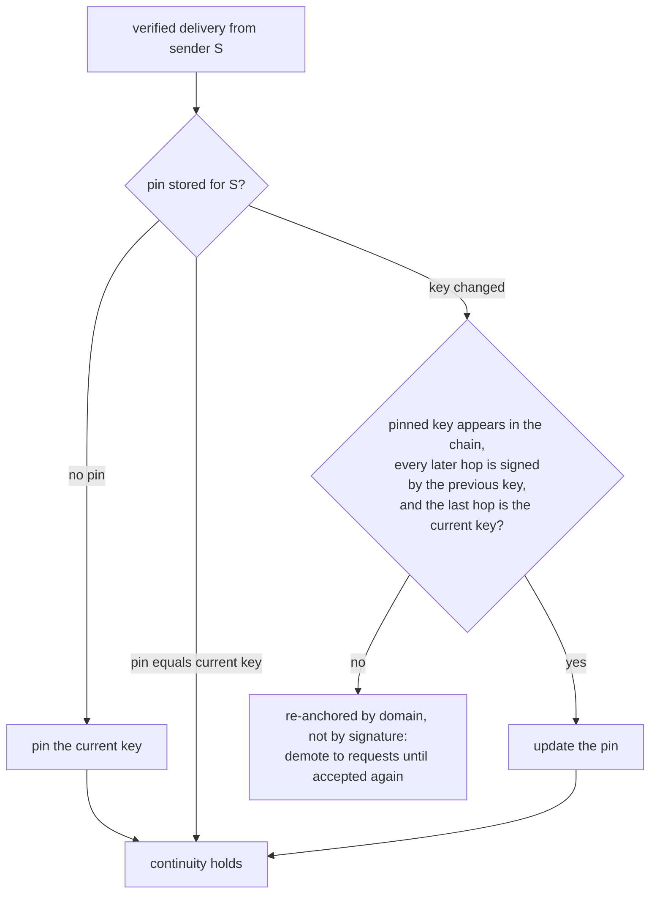

# HMTP protocol specification

**Version 1** (the `v` field of every message).

HMTP (HTTP Mail Transfer Protocol) is a convention over HTTPS for delivering signed, end-to-end encrypted mail between independent nodes. This document is the normative wire specification: everything an implementation needs to interoperate with other nodes without reading the reference code. How to run the reference node lives in the [README](README.md).

The key words MUST, MUST NOT, SHOULD and MAY are to be interpreted as described in RFC 2119.

## 1. Addresses

An address has the form `user@domain`, where `domain` is the authority that serves the discovery document (a port is allowed for local development). The `user` part MUST be usable verbatim as a URL path segment.

## 2. Discovery

A node publishes each mailbox at:

```
GET https://<domain>/.well-known/hmtp/<user>
```

The response is `200` with a JSON document:

```json
{
  "address": "ana@example.com",
  "inbox": "https://mail.example.net/hmtp/inbox/ana",
  "signing_key": "<base64, 32-byte raw Ed25519 public key>",
  "rotations": [
    {"key": "<base64, the first signing key ever>"},
    {"key": "<base64, the next key>", "sig": "<base64, made by the previous key>"}
  ],
  "encryption_key": "<base64, 32-byte raw X25519 public key>",
  "devices": {"laptop": "<base64, 32-byte raw X25519 public key>"}
}
```

- `address`, `inbox` and `signing_key` are REQUIRED. `encryption_key` SHOULD be present; without it, mail to this user travels as plaintext `content` (section 4).
- `rotations` SHOULD be present: the signing-key chain (section 11). The first entry carries no `sig` (the genesis key); every later entry's `sig` is an Ed25519 signature by the *previous* entry's key over the raw 32 bytes of the entry's key; the last entry MUST equal `signing_key`. Consumers treat an absent `rotations` as `[{"key": <signing_key>}]`.
- `devices` is OPTIONAL: extra encryption keys, one per device (section 13).
- `inbox` MAY live on any host: this document plays the role of the MX record, with per-user delegation. The inbox URL path is not normative; senders MUST use whatever URL the document declares.
- Unknown users get `404`. Unknown fields MUST be ignored.
- Keys are fetched live: consumers MUST NOT pin them for verification (the per-sender continuity pin of section 11 is a different, additional mechanism). Fetching the current document on every verification is what makes key rotation instantaneous.
- The document MUST be served over HTTPS. Everything in this spec that fetches a URL derived from an address or a message (discovery, inbox, blobs) MUST resolve the host first and refuse private, loopback, link-local or otherwise non-global addresses (SSRF guard).

## 3. Canonical JSON

Signatures and ids are computed over a canonical serialization of JSON objects, following RFC 8785 (JCS). For the field names and value types used by this spec, the canonical form reduces to:

- Object keys sorted lexicographically by Unicode code point.
- No insignificant whitespace: separators are exactly `,` and `:`.
- Minimal string escaping: only `\"`, `\\`, the two-character escapes (`\b`, `\t`, `\n`, `\f`, `\r`) and `\u00XX` (lowercase hex) for the remaining control characters. Non-ASCII characters are NOT escaped.
- The result is encoded as UTF-8 bytes.

In Python this is `json.dumps(obj, sort_keys=True, separators=(",", ":"), ensure_ascii=False).encode()`. The only non-string scalars in this spec are integers (`v`, attachment sizes), serialized without sign, padding or decimal point.

## 4. The message

A message on the wire is a JSON object:

```json
{
  "v": 1,
  "id": "sha256:<64 lowercase hex chars>",
  "from": "ana@example.com",
  "to": ["bob@example.org"],
  "date": "2026-07-29T12:00:00+00:00",
  "in_reply_to": "sha256:...",
  "attachments": [
    {"hash": "sha256:<64 hex>", "url": "https://...", "size": 5028}
  ],
  "sealed": {
    "cipher": "x25519-chacha20poly1305",
    "ephemeral_key": "<base64, 32-byte raw X25519 public key>",
    "nonce": "<base64, 12 bytes>",
    "data": "<base64 ciphertext>"
  },
  "sealed_devices": {"laptop": {"cipher": "...", "...": "..."}},
  "signature": "<base64, 64-byte Ed25519 signature>"
}
```

- `v` (REQUIRED): integer protocol version. This spec defines `1`.
- `id` (REQUIRED): content address of the plaintext, see section 5.
- `from` (REQUIRED): sender address. The signature is verified against this domain's published `signing_key`.
- `to` (REQUIRED): array of recipient addresses. A message with N recipients is delivered as N copies, each sealed to one recipient's key; all copies carry the same `to` array and therefore the same `id`.
- `date` (REQUIRED): ISO 8601 timestamp in UTC with seconds precision.
- `in_reply_to` (OPTIONAL): the `id` of the message this one replies to. Threads are a verifiable graph of content hashes; no heuristics.
- `attachments` (OPTIONAL): the visible attachment references, `{hash, url, size}` only, so the recipient's server can mirror blobs it cannot read (section 7). No names, no keys.
- Exactly one of (REQUIRED):
  - `sealed`: the encrypted content (section 6). Used whenever the recipient publishes an `encryption_key`.
  - `content`: the plaintext content object, only for recipients that publish no `encryption_key`.
- `sealed_devices` (OPTIONAL): one extra sealed copy of the same content per device key the recipient publishes (section 13).
- `signature` (REQUIRED): section 5.
- Unknown fields MUST be ignored (they are still covered by the signature).

The **content object** (plaintext, inside `sealed` or as `content`) is:

```json
{
  "subject": "a subject, possibly empty",
  "body": "the message text",
  "salt": "<base64, 16 random bytes>",
  "attachments": [
    {"name": "report.pdf", "hash": "sha256:<64 hex>", "url": "https://...",
     "size": 5028, "key": "<base64, 32 bytes>"}
  ]
}
```

- The subject travels inside the encrypted payload, as protected as the body; the visible envelope carries no human-readable content.
- The `salt` MUST be freshly random per message: since the `id` is a hash of the plaintext, without a salt the visible `id` would let anyone confirm a guessed short message.
- `attachments` (OPTIONAL) carries the full references: the visible fields plus the file `name` and the decryption `key`, both confidential.

## 5. Id and signature

**Id.** The *core* of a message is one flat object: the envelope fields `from`, `to`, `date` and (if present) `in_reply_to`, merged with the content fields (`subject`, `body`, `salt` and, if present, `attachments` with full references). Then:

```
id = "sha256:" + lowercase_hex(SHA-256(canonical(core)))
```

The id is computed by the sender **before sealing** and is a property of the plaintext: every copy of a message shares it, thread references match across nodes, and retries are idempotent. Note that `v`, `id` itself, the visible `attachments` list, `sealed`, `sealed_devices` and `signature` are not part of the core.

**Signature.** Ed25519 over the canonical form of the complete wire message minus the `signature` field: it covers `v` (downgrade protection), the envelope, the `id`, the visible attachment list and the ciphertexts (or plaintext `content`). The verification key is the `signing_key` currently published at the `from` domain.

Because the signature covers the ciphertext and each copy is sealed per recipient, different copies of one message have different signatures but the same id.

## 6. Sealing (end-to-end encryption)

The only cipher suite in version 1 is `x25519-chacha20poly1305`:

1. Serialize the content object as JSON (any valid serialization; the recipient parses it and re-canonicalizes only for the id check). Encode as UTF-8.
2. Generate an ephemeral X25519 key pair.
3. `shared = X25519(ephemeral_private, recipient_encryption_key)`.
4. `key = HKDF-SHA256(ikm=shared, salt=<absent>, info=ephemeral_public_bytes || recipient_public_bytes, length=32)` where `||` is byte concatenation of the raw 32-byte public keys.
5. Generate a random 12-byte nonce.
6. `data = ChaCha20-Poly1305(key, nonce, plaintext, aad=<none>)`.

The `sealed` object carries the cipher name, the ephemeral public key, the nonce and the ciphertext, all base64. To decrypt, the recipient repeats the exchange with its private key; after a key rotation it SHOULD retry with retained old keys so old mail stays readable. The same construction, with a different recipient public key, produces each entry of `sealed_devices`.

This suite is a minimal sealed box in the spirit of HPKE (RFC 9180), not the RFC's wire format. A future version could adopt HPKE proper; the `cipher` field exists so that can happen without ambiguity.

## 7. Attachments

Attachments live **outside the message**, by reference, encrypted end to end:

**Sender duties.**

1. Encrypt each file with a fresh single-use 32-byte key: `blob = nonce || ChaCha20-Poly1305(key, nonce, file_bytes, aad=<none>)` with a random 12-byte nonce.
2. Compute `hash = "sha256:" + lowercase_hex(SHA-256(blob))` and serve the blob at a URL on the sender's own server as `application/octet-stream` (the reference node uses `GET <base>/hmtp/blob/<hex digest>`; the `url` in the reference is authoritative, the path is not normative).
3. Put the full reference `{name, hash, url, size, key}` (size = blob size in bytes) inside the sealed content, and the redacted reference `{hash, url, size}` in the visible `attachments` list. The server side learns how many blobs exist and how big they are, never their names or contents.

**Receiver duties.**

- The receiving server SHOULD **mirror at delivery** the blobs of mail accepted into the inbox: download each visible reference (SSRF guard on the URL), verify size and hash, store locally. The recipient then reads from its own server, so opening an attachment reveals nothing to the sender (no read receipts, no IP).
- Mail landing in the requests box MUST NOT be auto-mirrored: strangers cannot fill the receiver's disk. Mirroring happens when (and if) the sender is accepted.
- The delivery response reports what was stored, so the sender MAY delete blobs once its recipients confirm: `{"delivered": "<id>", "mirrored": ["sha256:...", "..."]}`.
- Receivers MAY cap blob size and count (the reference node: 10 000 000 bytes per blob, at most 4 attachments per message, `400` beyond that) and skip mirroring anything over the cap.

**Recipient duties (on save).**

- The sealed references and the visible list MUST agree on the `(hash, size)` pairs; a mismatch means the sender told the server and the recipient different stories, and the attachments MUST be refused.
- Verify the blob's size and hash before decrypting; treat the `name` as untrusted (strip any path components).

The full lifecycle (non-normative illustration):



## 8. Delivery

Delivery is one HTTP request per recipient copy:

```
POST <inbox URL from the recipient's discovery document>
Content-Type: application/hmtp+json

<the message JSON>
```

Senders MUST send `Content-Type: application/hmtp+json`; receivers SHOULD also accept `application/json`.

Responses:

| Code | Meaning | Sender behavior |
|---|---|---|
| `201` | delivered and stored (body reports `mirrored` blobs) | done |
| `200` | duplicate: this `id` was already stored | done (a retry succeeded twice) |
| `400` | malformed message, unsupported `v`, or too many attachments | give up |
| `401` | signature verification failed | give up |
| `402` | postage required for this first contact | give up; a human may resend the same message with a stamp |
| `404` | unknown mailbox | give up |
| `413` | message too large (reference node caps at 64 000 bytes) | give up |
| `503` | receiver could not fetch the sender's keys right now | retry later |

Retry semantics, also for codes not in the table: every `4xx` is a **permanent rejection** and the sender MUST drop the message instead of retrying it; transport failures and `5xx` responses (in practice `503`) are retryable.

**Postage.** A receiver MAY require postage from strangers. When enabled, a delivery from a sender not in the receiver's contacts, carrying no valid stamp, is answered with `402` and a challenge header:

```
WWW-Authenticate: HMTP-Stamp realm="<recipient address>"
```

A stamp is an opaque single-use token issued by the recipient's node and distributed **out of band** (handed out, sold, printed on a business card; payment rails are out of scope, see section 16). The sender resends the *same* message (same id) with:

```
Authorization: HMTP-Stamp <token>
```

The receiver consumes the stamp on acceptance: a second use is `402` again. Accepted contacts never need stamps. The shape (402, `WWW-Authenticate` challenge, pay out of band, retry with proof) follows the L402 pattern:



**Store-and-forward** lives on the **sender's** side: the client hands the signed message to its own node, and that node queues undeliverable copies and retries with exponential backoff (reference: 5 minutes doubling per attempt, capped at one day). Retries MUST resend the same message (same id), which makes them idempotent by construction.

## 9. Verification duties

**The receiving server** MUST perform all of these checks on every POST; the reference node applies them in this order:

1. Reject if the mailbox is unknown (`404`).
2. Reject if oversized (`413`).
3. Reject if `v` is not a supported version (`400`).
4. Reject if the shape is wrong: missing required fields, not exactly one of `sealed` / `content`, or too many attachments (`400`).
5. If the message carries plaintext `content`, check that `id` matches the core hash (`401` on mismatch). With `sealed` content the server cannot check this: it stores ciphertext it cannot read.
6. Fetch the discovery document of the `from` domain (SSRF guard applies). If unreachable, answer `503` so the sender retries.
7. Verify the Ed25519 signature over `canonical(message minus signature)` against the published `signing_key`. On failure, `401`.
8. If postage is enabled and the sender is not a contact, require and consume a valid stamp (`402` otherwise).
9. Check key continuity (section 11); the result decides the box, not acceptance.
10. Deduplicate by exact `id` string: store if new (`201`), acknowledge without storing if seen (`200`). Then mirror attachments if the message landed in the inbox (section 7).

**The recipient**, when opening a message:

1. Unseal the content with its encryption key(s).
2. Rebuild the core (envelope fields + unsealed content fields) and recompute the id. If it does not match the message's `id`, the message MUST be treated as invalid (the sender lied about the content address; the reference client displays a marker instead of the content).

The split matters: the server authenticates *who sent it and that nothing was altered in transit*; the recipient additionally verifies *that the id really names this plaintext*.

The server pipeline as a decision tree (non-normative illustration):



## 10. Consent (receiver policy)

Receivers SHOULD keep a contacts set per mailbox:

- Mail from a known contact **with key continuity** (section 11) goes to the **inbox**.
- Everything else goes to a **requests** box, first message visible. Accepting a sender moves their mail to the inbox, admits them permanently, re-trusts their current key (clears the continuity pin) and mirrors the attachments that delivery deferred.
- Sending a message to an address SHOULD add it to the sender's own contacts: writing to someone welcomes their replies.

This is local policy, not wire format: nodes with different consent rules still interoperate.

## 11. Key rotation and continuity

**Rotation ceremony.** To rotate, a node generates new keys and publishes them; nothing else. The outgoing signing key signs the new one, and the entry `{key, sig}` is appended to the `rotations` chain in the discovery document (format in section 2). Rotated-out encryption private keys MUST be retained locally so old sealed mail stays readable. Because verifiers fetch keys live, the new signing key is trusted network-wide the moment it is published, and a stolen key stops working just as fast.

**Continuity (receiver duty).** Receivers SHOULD pin, per sender, the signing key seen on the first verified delivery. On a later delivery:

- If the published key equals the pin, continuity holds.
- If it changed, the receiver walks the published `rotations` chain from the pinned key to the current one, verifying every hop's signature. A valid path updates the pin: the same identity rotated, and it can prove it.
- If the pinned key is not in the chain, or any hop fails, the identity was **re-anchored by the domain, not by a signature** (lost key, expired domain, hostile takeover: the receiver cannot tell). Version 1's response is demotion: the mail is delivered to the requests box even if the sender was an accepted contact, and consent must be earned again. Accepting the sender re-pins whatever the domain publishes now.

Continuity protects established relationships, not first contact: the first pin is trust-on-first-use. A stored signature is only re-verifiable against keys still published in the chain.

The decision, per verified delivery (non-normative illustration):



## 12. Reading

Message delivery (this spec) and mailbox reading are separate concerns. Version 1 defines one minimal read endpoint so the mailbox owner's devices can fetch mail:

```
GET <base>/hmtp/mailbox/<user>
Authorization: Bearer <read token>
```

The response is `200` with `{"inbox": [<messages>], "requests": [<messages>]}`, each message exactly as it arrived on the wire: still sealed. End-to-end encryption is preserved through reading; each device decrypts its own copy locally. A missing or wrong token is `401`.

The read token is a local credential between the owner and their own node (the reference node generates it at `init` and prints it with `token`); it never appears in the discovery document. Full mailbox synchronization (JMAP, RFC 8620) is out of scope, see section 16.

## 13. Multi-device

A mailbox owner MAY publish additional encryption keys, one per device, in the discovery document's `devices` map. Device key pairs are generated **on the device**; only the public key is registered (the reference node: `device keygen` on the new device, `device add <name> <public key>` on the node). How keys move between owner and node is out of band.

When the recipient publishes devices (which is only meaningful alongside an `encryption_key`), the sender MUST seal one extra copy of the same content to each device key and ship them in `sealed_devices`, keyed by device name. All copies carry the same plaintext, so the id is unchanged; `sealed_devices` rides outside the core and is covered by the signature. A device reads the mailbox through the endpoint of section 12, decrypts its own entry and verifies the id like any recipient (section 9).

Signing stays single-key: devices read; the node signs.

## 14. Test vector

A fully deterministic message (plaintext `content`, so no encryption randomness). Given:

- Ed25519 private key (raw seed, base64): `AAECAwQFBgcICQoLDA0ODxAREhMUFRYXGBkaGxwdHh8=` (bytes `00 01 02 ... 1f`)
- Corresponding public key (base64): `A6EHv/POEL4dcN0Y50vAmWfk1jCbpQ1fHdyGZBJVMbg=`
- `from`: `ana@example.com`, `to`: `["bob@example.org"]`, `date`: `2026-07-29T12:00:00+00:00`
- content: subject `Test vector`, body `Hyvää yötä`, salt `MDEyMzQ1Njc4OWFiY2RlZg==` (the ASCII bytes `0123456789abcdef`), no attachments

Canonical core (one line, UTF-8):

```
{"body":"Hyvää yötä","date":"2026-07-29T12:00:00+00:00","from":"ana@example.com","salt":"MDEyMzQ1Njc4OWFiY2RlZg==","subject":"Test vector","to":["bob@example.org"]}
```

Resulting id:

```
sha256:fa30967952300d997b0f15084a77567386040d8a9fcb24bd62ba0d556471e396
```

Canonical signed payload (one line, UTF-8):

```
{"content":{"body":"Hyvää yötä","salt":"MDEyMzQ1Njc4OWFiY2RlZg==","subject":"Test vector"},"date":"2026-07-29T12:00:00+00:00","from":"ana@example.com","id":"sha256:fa30967952300d997b0f15084a77567386040d8a9fcb24bd62ba0d556471e396","to":["bob@example.org"],"v":1}
```

Resulting signature (base64):

```
RbTXfGkk6TJ69Kau9Pn2WSHvQ4tMJzAFs1a7pgEMZg6/yRIQQ2vVjr4PpcjfqKiZX9qf3HzaQtxEXjJTW2Y5Bw==
```

An implementation that reproduces the id and the signature byte for byte (Ed25519 is deterministic) canonicalizes, hashes and signs correctly. Note the body is intentionally non-ASCII: if your canonical form escapes `ä` as `ä` instead of emitting the raw UTF-8 bytes, the hashes will not match (section 3).

## 15. Security considerations

- **What is protected**: subject, body, attachment names and attachment contents are confidential end to end, and the whole message is authenticated. **What is visible**: the envelope (`from`, `to`, `date`, `id`, `in_reply_to`) plus the attachment count and sizes are readable by both servers; traffic analysis of who writes to whom is not addressed.
- **No forward secrecy**: an ephemeral key is used per message, but compromise of a recipient's long-term encryption key (or any device key) decrypts everything sealed to it, including retained old keys after rotation.
- **Identity is the domain**: keys are fetched live, so whoever controls the domain (or its web server, or a CA willing to misissue) controls the identity going forward. The continuity pin (section 11) turns a silent key swap against an established correspondent into a visible demotion, but it cannot protect first contact, and a patient attacker who also steals the signing key can extend the chain legitimately.
- **Replay**: deduplication by id makes redelivery of the same message idempotent; the signed `to` field stops relaying a copy to a different mailbox as if intended for it. The signed `date` is sender-asserted and not proof of sending time.
- **Denial of service**: receivers verify signatures only after cheap shape and size checks, but fetching the sender's discovery document on every delivery is an amplification vector; receivers SHOULD cache discovery documents briefly and rate-limit per source. Attachment mirroring is the larger lever, which is why auto-mirroring for the requests box is forbidden and caps on blob size and count are expected.
- **Stamps are bearer tokens**: whoever holds one can use it once. They rate-limit cold contact; they are not proof of payment or identity.
- **The read token is a bearer credential**: it grants full mailbox reads and MUST only travel over HTTPS.
- The reference implementation's cryptography is **unaudited**. Do not use it for secrets anyone depends on.

## 16. Out of scope in version 1

- **Full mailbox synchronization**: the read endpoint of section 12 is deliberately minimal; JMAP (RFC 8620) is the natural next step.
- **Payment rails for stamps**: issuance and settlement are out of band; binding stamps to a real payment protocol (e.g. L402) is future work.
- **Large attachments**: the one-shot blob encryption holds files in memory and is capped accordingly; chunked or streaming encryption would lift the cap.
- **Automated device enrollment**: device public keys are registered manually; pairing flows and device revocation semantics are not specified.
- **Timed re-anchor announcements**: version 1 answers a broken key chain by demoting the sender to the requests box; a domain-published announcement window ("this identity was re-anchored on date X") could complement it.
